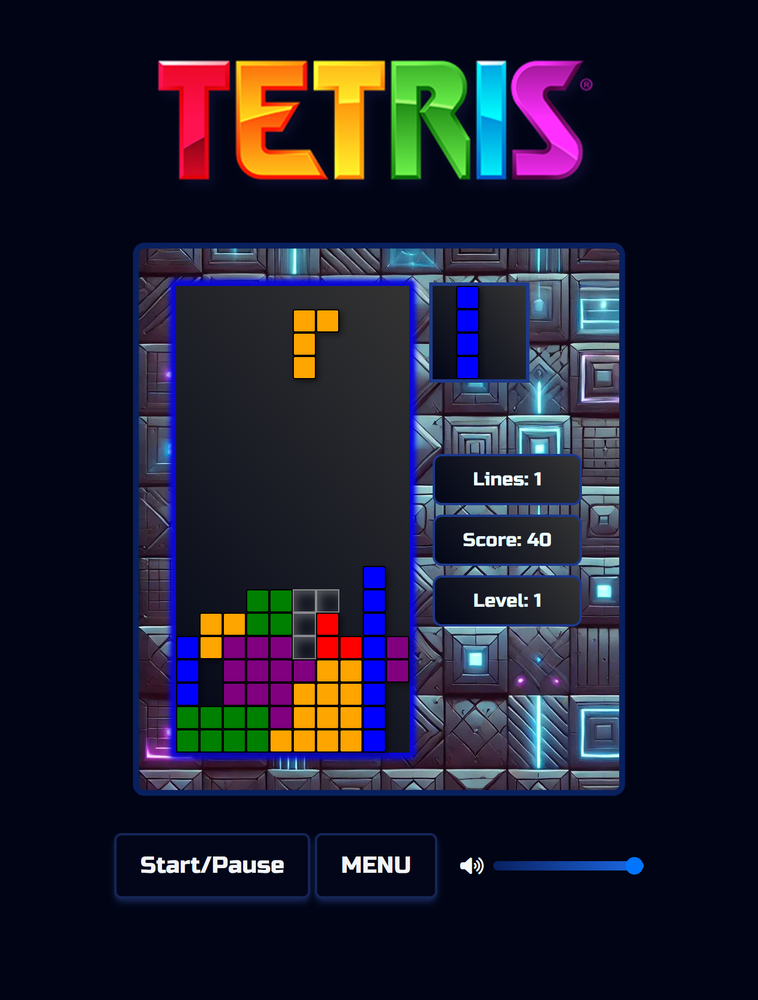
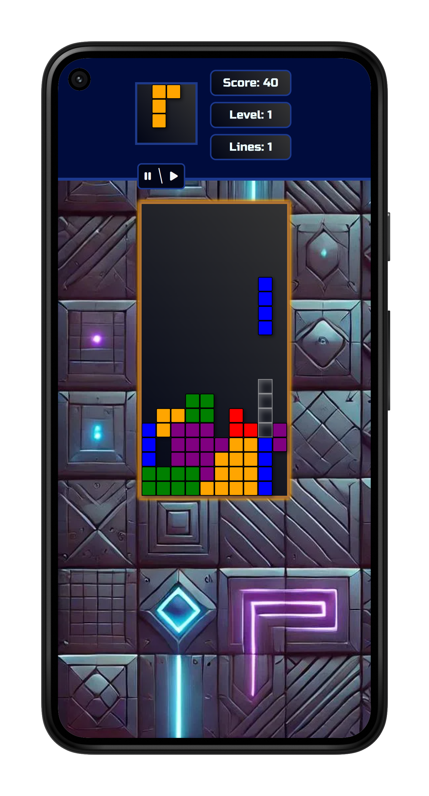
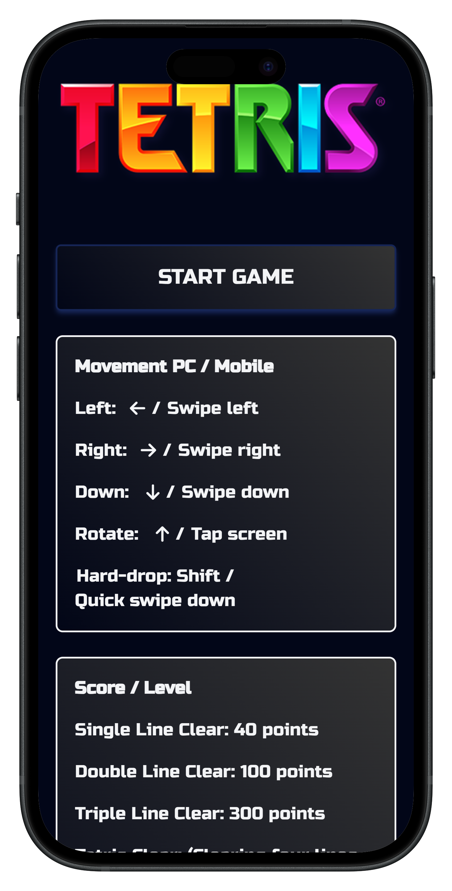

Tetris game

A modern Tetris clone built with JavaScript and Tailwind CSS. Playable on both desktop and mobile, with leaderboard, levels, and smooth animations.

## 🚀 Live app

👉 [Try it here](https://pro-tetris.netlify.app/)

## Features

- Works on mobile (touch movement) and PC (keyboard).
- Fast drops
- Levels
- Leaderboard – top 10 scores saved to localStorage
- Sound effects, animations
- See live PC performance stats
- Responsive design with smooth UX

**Tech Stack**

- **Languages:** Javascript, HTML, CSS
- **Styling:** Tailwind CSS
- **Hosting:** Netlify

## 📸 Screenshots







## ⚙️ Getting Started

```bash
git clone https://github.com/MatiasTervonen/tetris-game.git
cd tetris-game
pnpm install
pnpm dev
```
